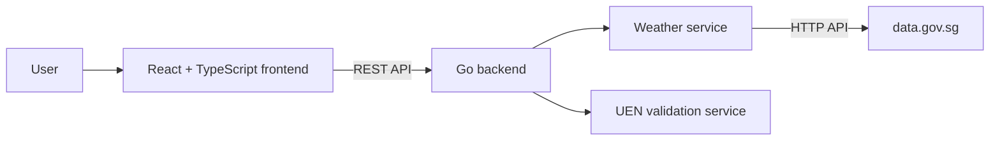

# OneST Services Portal

A full-stack application containing:

- Singapore two-hour weather forecasts from data.gov.sg
- Singapore Unique Entity Number (UEN) validation

The backend is built with Go, while the frontend uses React, TypeScript, and Vite.

# Architecture

The application uses a React and TypeScript frontend that communicates with a modular Go REST API, which handles UEN validation locally and retrieves weather data from data.gov.sg.



## Prerequisites

Install the following tools before running the project:

- [Git](https://git-scm.com/)
- [Go](https://go.dev/doc/install)
- [Node.js](https://nodejs.org/) and npm
- Make

React, TypeScript, Vite, and the other frontend packages do not need to be installed globally. They are installed from `frontend/package.json` and `frontend/package-lock.json` during project setup.

You can verify the required tools with:

```bash
git --version
go version
node --version
npm --version
make --version
```

If you use `nvm`, select the Node.js version specified by `.nvmrc`:

```bash
nvm install
nvm use
```

## First-time workflow

```bash
git clone <repository-url>
cd onest
nvm use        # Only if you use nvm
make install
make dev
```

To see all available Make commands, run:

```bash
make
```

## Install dependencies

From the project root, run:

```bash
make install
```

This command downloads the Go modules and installs the exact frontend dependencies recorded in `package-lock.json`.

## Run locally

Start the backend and frontend together:

```bash
make dev
```

The application will normally be available at:

- Frontend: <http://localhost:5173>
- Backend: <http://localhost:8080>
- Health check: <http://localhost:8080/health>

Press `Ctrl+C` to stop both services.

## Run each service separately

Start only the backend:

```bash
make backend-run
```

Start only the frontend in another terminal:

```bash
make frontend-run
```

## Run checks and tests

Check the entire project:

```bash
make test
```

This command:

- Formats, vets, and tests the Go backend
- Lints and builds the React frontend

Run only the backend tests:

```bash
make backend-test
```

Run all backend checks:

```bash
make backend-check
```

Run the frontend checks:

```bash
make frontend-check
```

## Build the backend executable

To compile the backend:

```bash
make backend-build
```

The executable is written to:

```text
backend/bin/server
```

The `backend/bin/` directory contains generated build output and is excluded from Git.

## Update dependencies

After adding or removing a Go dependency, run:

```bash
make backend-tidy
```

If the frontend dependencies in `package.json` or `package-lock.json` change, reinstall them with:

```bash
cd frontend
npm install
```

Normal changes to React, TypeScript, or CSS source files do not require reinstalling `node_modules`.
